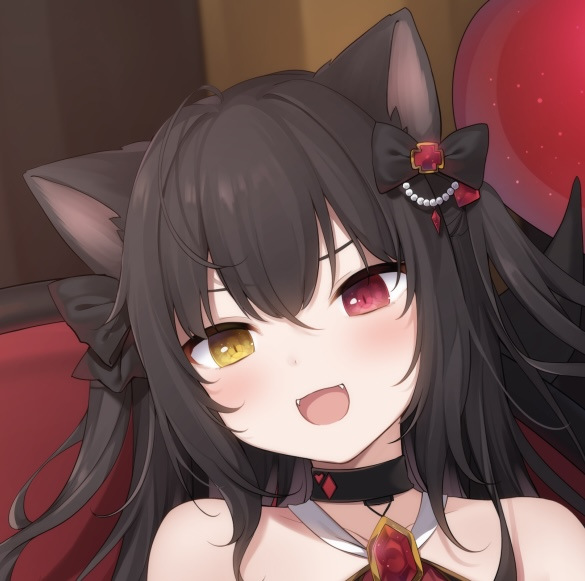

<h1 align="center">清風之戀の小窩</h1>

  

    

- Currently learning Rust and Modern C++.

- I'm interested in Linux, Reverse and Compiler. ^_^

- I mainly use C/C++ and Rust.

- Like ArchLinux

- Currently working on: [clice](https://github.com/clice-project/clice)

- Come and see [my blog](https://aurora0x27.github.io)

<!--

-->

